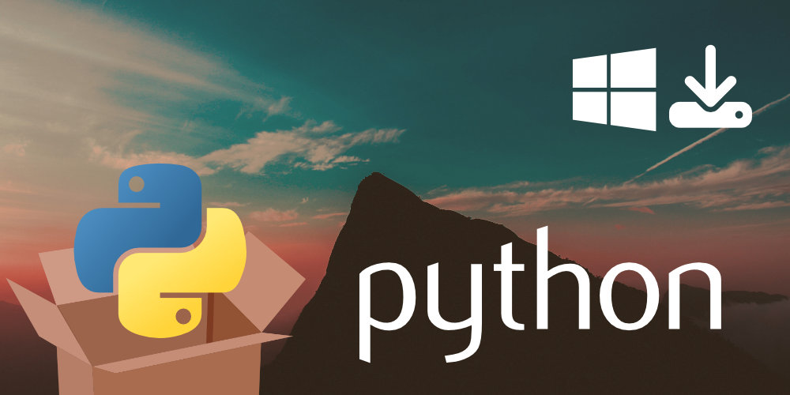
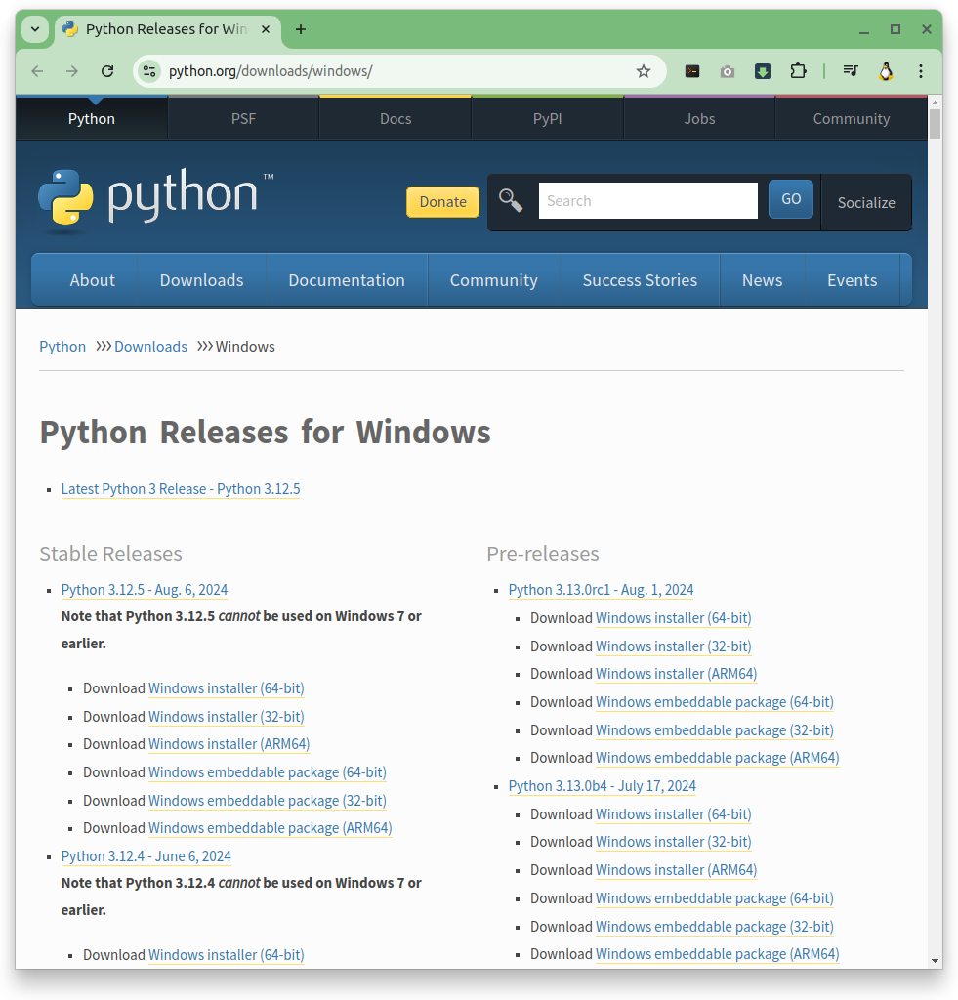
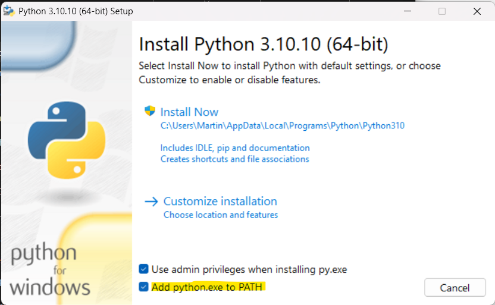
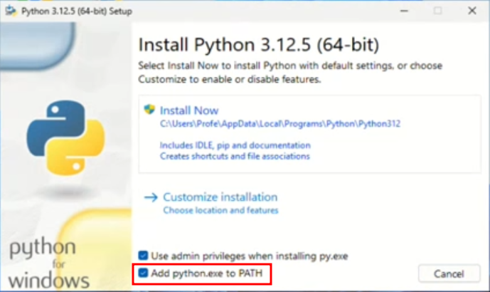
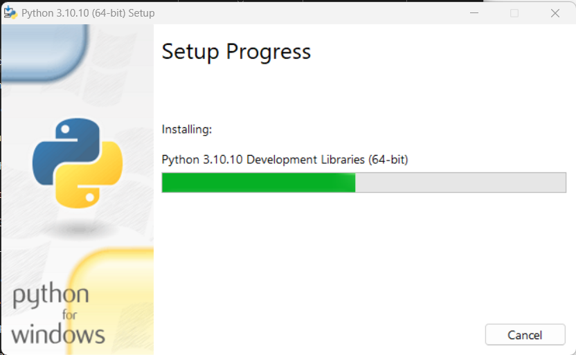
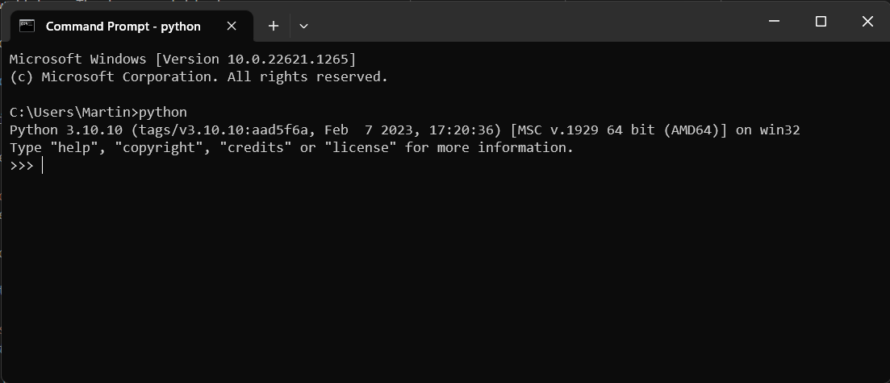

# Instal·lar **Python** a Windows

Abans de començar a crear **aplicacions GUI** amb **Python**, necessitareu una instal·lació funcional de **Python** al vostre ordinador!

En aquest breu tutorial, treballarem els passos per aconseguir una instal·lació de **Python** que funcioni, utilitzant l'últim **Python**.

## Instal·lació de **Python** a Windows

Aneu a la [pàgina de descàrregues de Windows del lloc web oficial de **Python**](https://www.python.org/downloads/windows/) i descarregueu una de les versions estables de **Python**.

Cal que us descarregueu la versió **Windows Installer (64 bits)** per al ***maquinari*** modern. Si no sabeu que necessiteu la versió de **`32 bits`**, proveu primer la de **`64 bits`**.

## Podeu descarregar-vos l'executable seguint aquest enllaç [`python-3.12.5-amd64.exe`](files/python-3.12.5-amd64.exe)

Un cop finalitzada la descàrrega, feu doble clic a l'instal·lador per iniciar-lo.

Veureu la pantalla de benvinguda de l'instal·lador que descriu què farà l'instal·lador.

<!--  -->

> [!TIP]
> Assegureu-vos que **`Add python.exe to PATH`** estigui marcat a l'instal·lador. Aquesta opció fa que sigui més fàcil utilitzar **Python** des de l'indicador d'ordres: només cal que introduïu "`python`" per començar, en lloc del camí complet a l'executable.

Quan estigueu preparat per ser la instal·lació, podeu fer clic a **Install Now** (***Instal·la ara***).

La instal·lació continuarà amb normalitat, instal·lant totes les biblioteques necessàries (incloent **`Tcl/Tk`** per a **`Tkinter`**). Un cop completat, podeu sortir de l'instal·lador.

Obriu un indicador d'ordres i inicieu **Python** introduint python. Això iniciarà el `**Python** REPL`, on podeu introduir codi **Python** interactiu.

### Video de la instal·lació

> installacio-python-win-11.gif

> installacio-python-win-11.mp4

